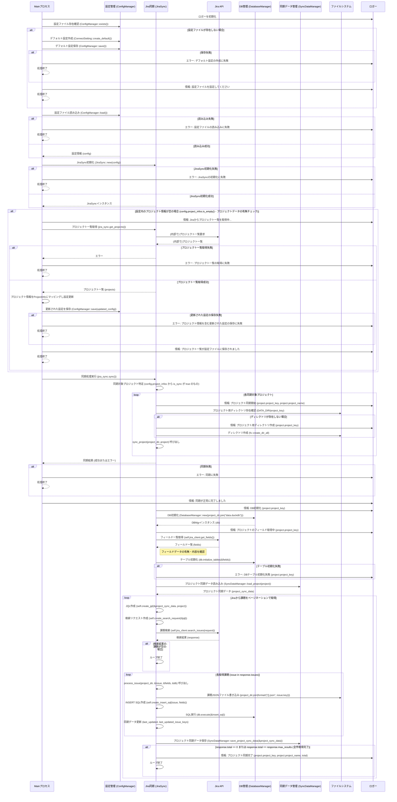

```mermaid
sequenceDiagram
    participant Main as Mainプロセス
    participant CfgMgr as 設定管理 (ConfigManager)
    participant JiraS as Jira同期 (JiraSync)
    participant JiraAPI as Jira API
    participant DBMgr as DB管理 (DatabaseManager)
    participant SyncDataMgr as 同期データ管理 (SyncDataManager)
    participant FileSystem as ファイルシステム
    participant Logger as ロガー

    %% Mainプロセスからの呼び出し
    Main->>Logger: ロガーを初期化
    Main->>CfgMgr: 設定ファイル存在確認 (ConfigManager::exists())
    alt 設定ファイルが存在しない場合
        Main->>CfgMgr: デフォルト設定作成 (ConnectSetting::create_default())
        Main->>CfgMgr: デフォルト設定保存 (ConfigManager::save())
        alt 保存失敗
            Main->>Logger: エラー: デフォルト設定の作成に失敗
            Main-->>Main: 処理終了
        end
        Main->>Logger: 情報: 設定ファイルを設定してください
        Main-->>Main: 処理終了
    end

    Main->>CfgMgr: 設定ファイル読み込み (ConfigManager::load())
    alt 読み込み失敗
        Main->>Logger: エラー: 設定ファイルの読み込みに失敗
        Main-->>Main: 処理終了
    else 読み込み成功
        CfgMgr-->>Main: 設定情報 (config)
    end

    Main->>JiraS: JiraSync初期化 (JiraSync::new(config))
    alt JiraSync初期化失敗
        Main->>Logger: エラー: JiraSyncの初期化に失敗
        Main-->>Main: 処理終了
    else JiraSync初期化成功
        JiraS-->>Main: JiraSyncインスタンス
    end

    alt 設定内のプロジェクト情報が空の場合 (config.project_infos.is_empty() - プロジェクトデータの有無チェック)
        Main->>Logger: 情報: Jiraからプロジェクト一覧を取得中...
        Main->>JiraS: プロジェクト一覧取得 (jira_sync.get_projects())
        JiraS->>JiraAPI: (内部で)プロジェクト一覧要求
        JiraAPI-->>JiraS: (内部で)プロジェクト一覧
        alt プロジェクト一覧取得失敗
            JiraS-->>Main: エラー
            Main->>Logger: エラー: プロジェクト一覧の取得に失敗
            Main-->>Main: 処理終了
        else プロジェクト一覧取得成功
            JiraS-->>Main: プロジェクト一覧 (projects)
            Main->>Main: プロジェクト情報をProjectInfoにマッピングし設定更新
            Main->>CfgMgr: 更新された設定を保存 (ConfigManager::save(updated_config))
            alt 更新された設定の保存失敗
                 Main->>Logger: エラー: プロジェクト情報を含む更新された設定の保存に失敗
                 Main-->>Main: 処理終了
            end
            Main->>Logger: 情報: プロジェクト一覧が設定ファイルに保存されました
            Main-->>Main: 処理終了
        end
    end

    Main->>JiraS: 同期処理実行 (jira_sync.sync())

    %% JiraSync::sync() メソッドの内部
    JiraS->>JiraS: 同期対象プロジェクト特定 (config.project_infos から is_sync が true のもの)
    loop 各同期対象プロジェクト
        JiraS->>Logger: 情報: プロジェクト同期開始 (project.project_key, project.project_name)
        JiraS->>FileSystem: プロジェクト用ディレクトリ存在確認 (DATA_DIR/project_key)
        alt ディレクトリが存在しない場合
            JiraS->>Logger: 情報: プロジェクト用ディレクトリ作成 (project.project_key)
            JiraS->>FileSystem: ディレクトリ作成 (fs::create_dir_all)
        end
        JiraS->>JiraS: sync_project(project_dir, project) 呼び出し
    end
    JiraS-->>Main: 同期結果 (成功またはエラー)
    alt 同期失敗
        Main->>Logger: エラー: 同期に失敗
        Main-->>Main: 処理終了
    end
    Main->>Logger: 情報: 同期が正常に完了しました


    %% JiraSync::sync_project() メソッドの内部
    %% JiraS->>JiraS: sync_project(project_dir, project) 呼び出し (上記から継続)
    JiraS->>Logger: 情報: DB初期化 (project.project_key)
    JiraS->>DBMgr: DB初期化 (DatabaseManager::new(project_dir.join("data.duckdb")))
    DBMgr-->>JiraS: DBMgrインスタンス (db)

    JiraS->>Logger: 情報: プロジェクトのフィールド取得中 (project.project_key)
    JiraS->>JiraAPI: フィールド一覧取得 (self.jira_client.get_fields())
    JiraAPI-->>JiraS: フィールド一覧 (fields)
    note right of JiraS: フィールドデータの有無・内容を確認
    JiraS->>DBMgr: テーブル初期化 (db.initialize_tables(&fields))
    alt テーブル初期化失敗
        JiraS->>Logger: エラー: DBテーブル初期化失敗 (project.project_key)
        %% エラーハンドリング (図では簡略化、実際にはエラーが返る)
    end

    JiraS->>SyncDataMgr: プロジェクト同期データ読み込み (SyncDataManager::load_project(project))
    SyncDataMgr-->>JiraS: プロジェクト同期データ (project_sync_data)

    loop Jiraから課題をページネーションで取得
        JiraS->>JiraS: JQL作成 (self.create_jql(&project_sync_data, project))
        JiraS->>JiraS: 検索リクエスト作成 (self.create_search_request(&jql))
        JiraS->>JiraAPI: 課題検索 (self.jira_client.search_issues(request))
        JiraAPI-->>JiraS: 検索結果 (response)

        alt 検索結果の課題が空の場合
            JiraS->>JiraS: ループ終了

        end

        loop 各取得課題 (issue in response.issues)
            JiraS->>JiraS: process_issue(project_dir, &issue, &fields, &db) 呼び出し
            %% process_issue の内部
            JiraS->>FileSystem: 課題JSONファイル書き込み (project_dir.join(format!("{}.json", issue.key)))
            JiraS->>JiraS: INSERT SQL作成 (self.create_insert_sql(issue, fields))
            JiraS->>DBMgr: SQL実行 (db.execute(&insert_sql))
            %% process_issue 完了

            JiraS->>JiraS: 同期データ更新 (last_updated, last_updated_issue_keys)
        end

        JiraS->>SyncDataMgr: プロジェクト同期データ保存 (SyncDataManager::save_project_sync_data(&project_sync_data))

        alt response.total == 0 または response.total == response.max_results (全件取得完了)
            JiraS->>Logger: 情報: プロジェクト同期完了 (project.project_key, project.project_name, total)
            JiraS->>JiraS: ループ終了

        end
    end
    %% JiraS-->>JiraS: (sync_project 完了、結果を返す)
```